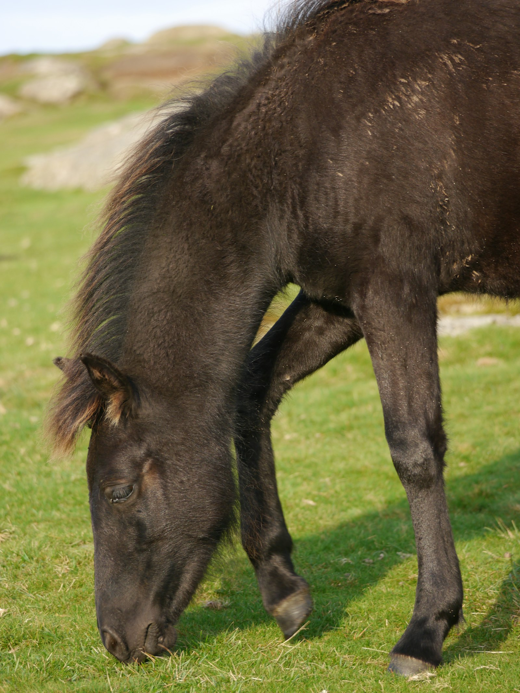

The morning starts before the pony is interested in it. Water buckets, a look along the fence, and hay in the usual place. The interesting part is the moment the gate swings and the field takes over.

Nothing on this list is exotic. That is the point of putting it on the site. People who have only seen ponies in pictures get the order of the day: look after the animal, then get out of the way.

1. Check the fence and the water.
2. Feed, then give the pasture time to work.
3. Groom whatever the mud left behind.
4. Stand still long enough to notice the weather.

The best entries are the specific ones: the frost on the bucket, the new mud by the gate, the morning the pony refused to leave the hedge.
