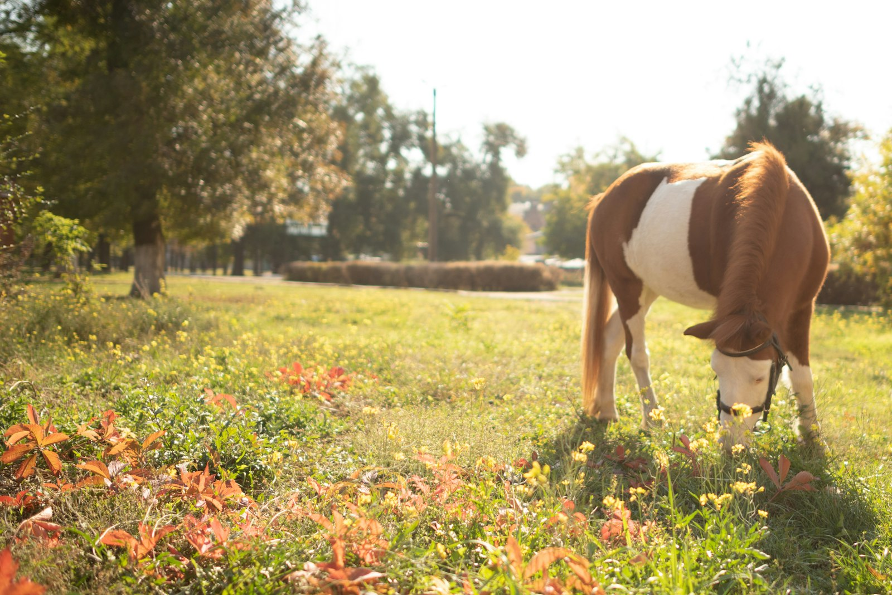
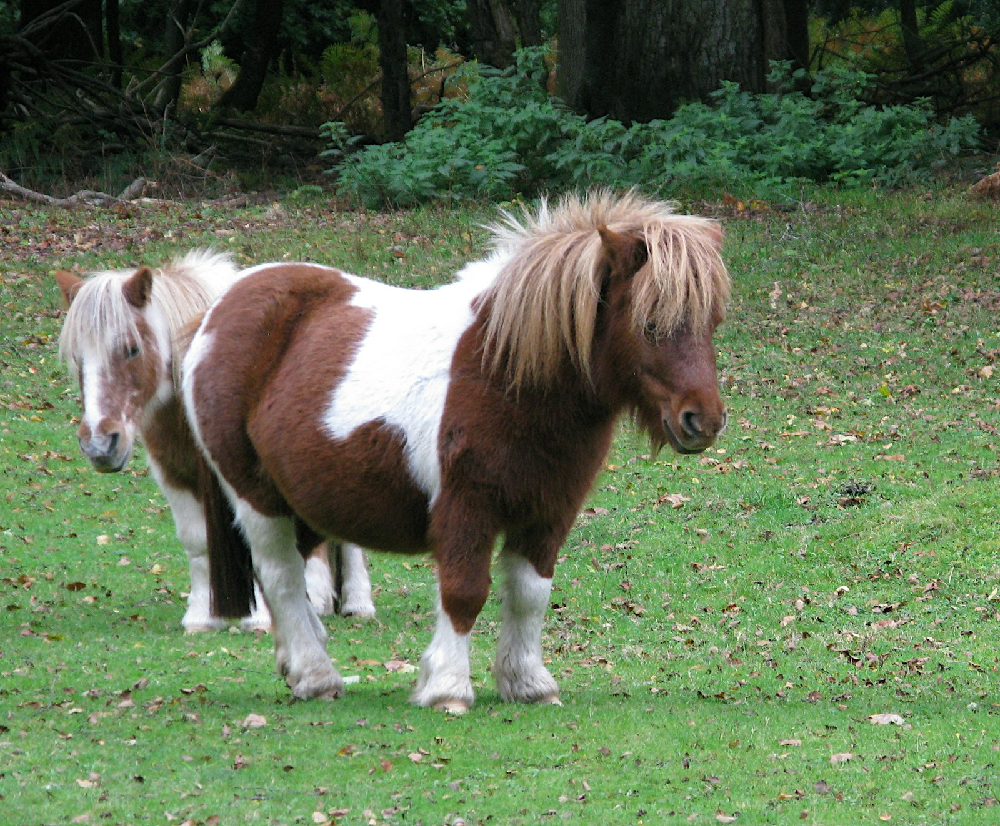

Every farm site needs a face. This one belongs to the pony who picks the sunny corner of the field and pretends not to notice you until the latch clicks.

The photographs are stand-ins for now: a portrait to lead the page, and a second frame for the field. When the real pony is in the folder, this is the story that should carry the name, the age, and the habit nobody expects.

The daily version is less dramatic than a photograph. There is grazing, a long look at the lane, and the occasional decision that a person is worth walking toward. That walk is the whole show.





When you write the real introduction, put the name, the age, and the habit nobody expects in this spot. A pony who steals hats, or one who only comes over for the grey-haired visitors, is a better story than a list of breeds.
